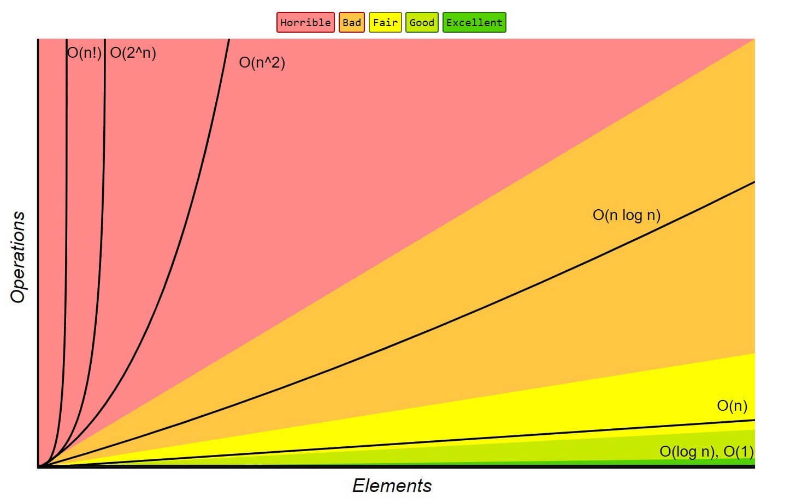

# Big O notation

- *"How code slows as data grows."*

1: Describes the performance of an algorithm as the amount of data increases.

2: Machine independent (# of steps to completion)

3: Ignore smaller operations: O(n + 1) -> O(n)

4: It's crucial for comparing algorithms and understanding their scalability.

Example: O(1), O(n), O(log n), O(n²)

## Complexity Classes: 

1: **Constant O(1)**
 - Resources used are independent of the input size
 - Time example: arithmetic operations, array index access of an element in an array
 - Space example: using a fixed-size array, inserting at the beginning of linkedlist

2: **Logarithmic O(log n)**
 - Resources usage grows logarithmically with input size
 - Time example: Binary search in a sorted array
 - Space example: Binary tree traversal

3: **Linear O(n)**
- Resource usage scales linearly with input size
- Time example: Element search in an unordered list
- Space example: Allocating an array proportional to input size

4: **Linearithmic O(n log n)**
 -  Resource usage grows at a rate between linear and quadratic
 - Time example: efficient sorting algorithms like merge sort and quicksort
 - Space example: Divide-and-conquer algorithms that decompose the problem

5: **Quadratic O(n²)**
 - Resource scale with the square of the input size
 - Time example: algorithm with simple nested loops: Bubble sort, insertion sort, quicksort
 - Space example: creating a two-dimensional matrix based on inpt size

6: **Exponential O(2^n)**
 - Resource usage doubles(or increases exponentially) with each additional unit of input.
 - Time example: Generating all subsets of a set
 - Space example: Recursive algorithms that double the size of the call stack for each input element

7: **Factorial O(n!)**
 - Traveling salesman problem

## Difference between Big-O, Big-Theta, and Big-Omega notations

 - **Big-O Notation: Upper bound**: defines worst-case scenario of an algorithm's performance. If an algorithm has time complexity of O(n^2). It means that the worst-case runtime will grow worst as n^2.

 - **Big-Theta Notation: exact bound**: defines exact growth rate, shows both an upper and lower limit for a function. Time complexity of O(n^2) will have worst-case performance that grows as n^2 and no worse than n^2.

 - **Big-Omega Notation: lower bound**: defines lower limit for the function growth rate. If an algorithm has time complexity of O(n). It means that the best-case performance will grow at least as k.n

**More reading: Below are useful links**

1: https://www.freecodecamp.org/news/big-o-cheat-sheet-time-complexity-chart/

2: https://www.freecodecamp.org/news/big-o-notation-why-it-matters-and-why-it-doesnt-1674cfa8a23c/

